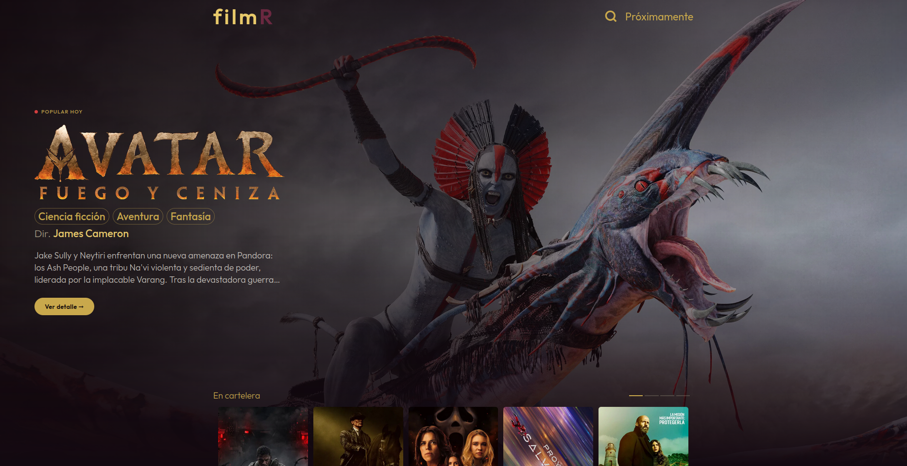
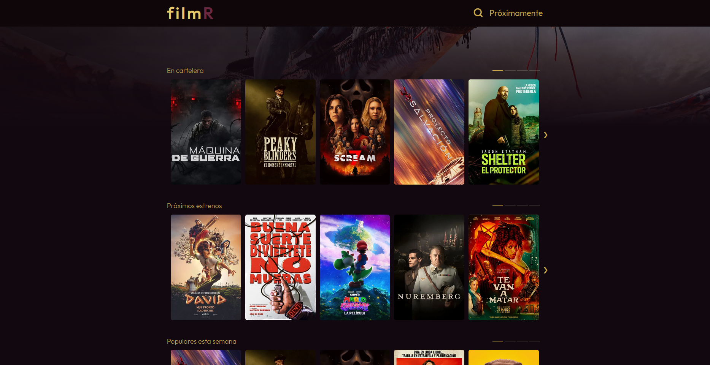
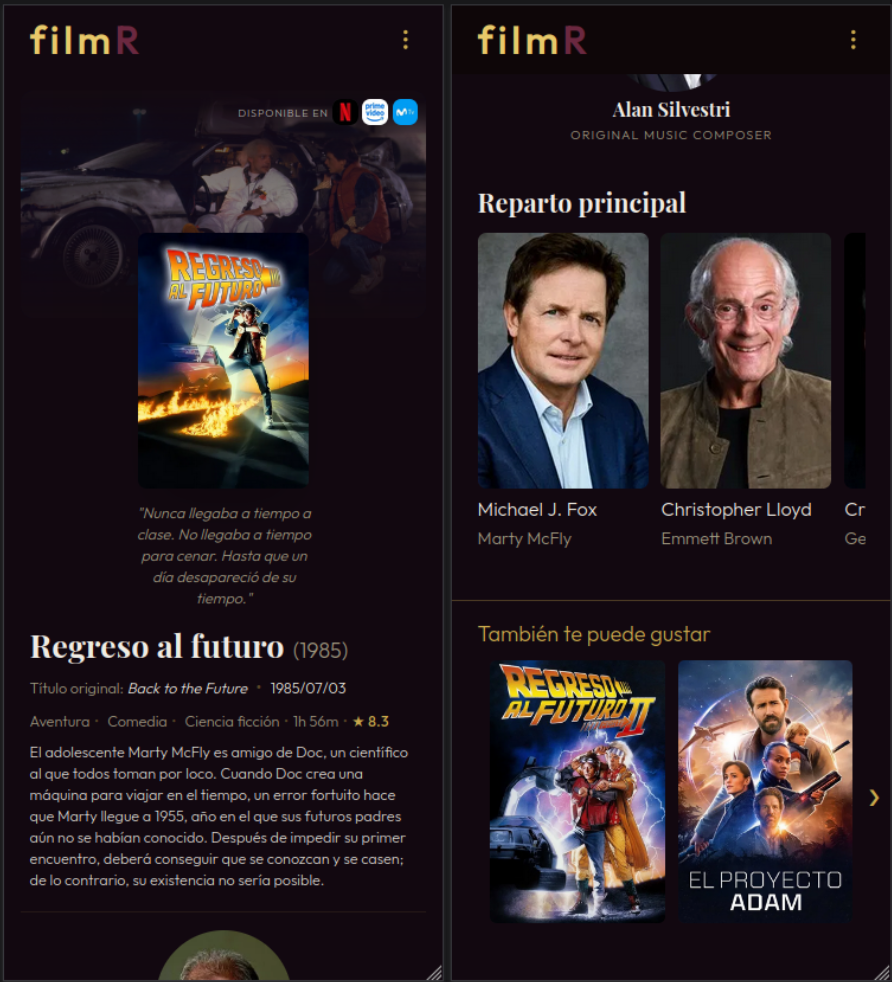

# filmR

Aplicacion web para descubrir peliculas usando la API de TMDB.
Este proyecto fue hecho como practica full stack con frontend en React y backend en FastAPI.

## Stack tecnologico

- Frontend: React 19, Vite, Tailwind CSS, React Router
- Backend: FastAPI, Pydantic, HTTPX
- API externa: TMDB
- Machine Learning: XGBoost, scikit-learn, pandas

## Features principales

- Home con hero y filas por categoria (en cartelera, proximos estrenos, tendencias, mejor valoradas)
- Busqueda por titulo
- Pagina de detalle con poster, datos principales, crew, cast y recomendaciones
- Prediccion de rating por IA en la fila de proximos estrenos
- Diseño responsive para mobile, tablet y desktop

## Prediccion de rating

La fila de proximos estrenos incluye una prediccion de rating generada por un modelo de machine learning entrenado con mas de 47,000 peliculas historicas de IMDb. El modelo usa el historial del director, el elenco, los generos, el idioma y el estudio de produccion para estimar el rating antes del estreno.

El modelo fue desarrollado en un repositorio separado ([film-rating-predictor](https://github.com/FacundoBerthet/film-rating-predictor)) e integrado al backend de Filmr a traves de un servicio dedicado (`ml_service.py`) que carga el modelo y los feature maps al iniciar la app.

## Correr localmente

Los pasos detallados estan en:

- Backend: `backend/README.md`
- Frontend: `frontend/README.md`

Resumen rapido:

1. Levantar backend
2. Configurar `VITE_API_URL` en frontend apuntando al backend
3. Levantar frontend

## Decisiones tecnicas destacadas

- Separacion simple por capas en backend (routers, servicios, modelos)
- Frontend organizado por paginas + componentes reutilizables
- Variables de entorno para evitar URLs hardcodeadas
- Uso de una API propia (backend) para no consumir TMDB directo desde el frontend
- Requests paralelos con `asyncio.gather()` para enriquecer la fila de proximos estrenos sin impactar la latencia
- Modelo ML cargado una sola vez al iniciar la app con joblib

## Capturas

Home (desktop):

Detalle (desktop):

Detalle (mobile):

Detalle (tablet):

## Mejoras futuras

- Manejo de errores mas completo en frontend
- Tests basicos de endpoints y componentes
- Filtros extra por genero/fecha/calificacion
- Mostrar la prediccion en la pagina de detalle de proximos estrenos
- Reentrenar el modelo periodicamente con datos mas recientes de IMDb